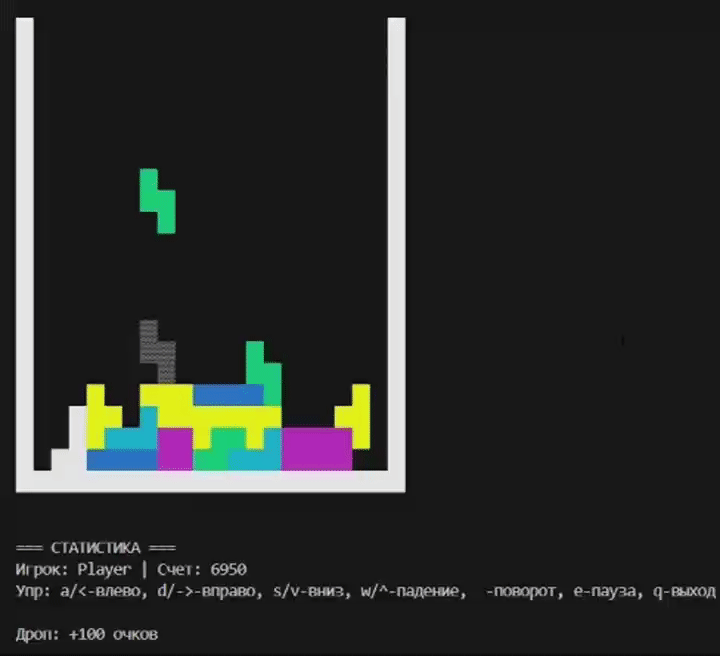

#  Тетрис - Консольная игра на C++

<div align="center">


</div>

Это реализация классической игры **Тетрис** для терминала Linux/Unix.
<div align="center">

</div>



## Особенности

-Цветная графика

-Настраиваемое управление

-Система рекордов

-Режим паузы

-Разные режимы

## Режимы игры

 1. Классический Тетрис
 2. Тетрис в форме ведра
 3. Режим "Собери картинку"
### Режимы последовательности фигур:
Игра поддерживает числовой аргумент для установки начального числа с которого начинается генерация случайных чисел. Это позволяет воспроизводить одинаковую последовательность фигур при разных запусках.


## Управление

### Стандартные клавиши:

| Клавиша | Действие | Альтернатива |
|---------|----------|--------------|
| **A** / **←** | Движение влево | Стрелка влево |
| **D** / **→** | Движение вправо | Стрелка вправо |
| **S** / **↓** | Ускоренное падение | Стрелка вниз |
| **W** / **↑** | Мгновенный сброс | Стрелка вверх |
| **Пробел** | Поворот фигуры | |
| **E** | Пауза / Продолжить | |
| **Q** | Выход из игры | |

> **Все клавиши можно переназначить в настройках игры**

## Установка

### Шаги установки:

```basht
git clone https://github.com/Olesya077/TETRIS
cd TETRIS
mkdir build
cd build
cmake ..
make
```

## Запуск

```bash
# Без аргументов
./tetris_game

# С числовым аргументом 
./tetris_game 42

```

 


</div>


